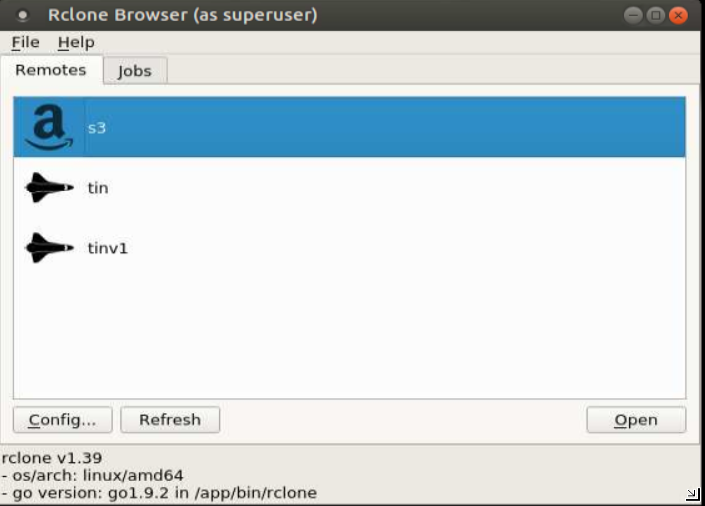
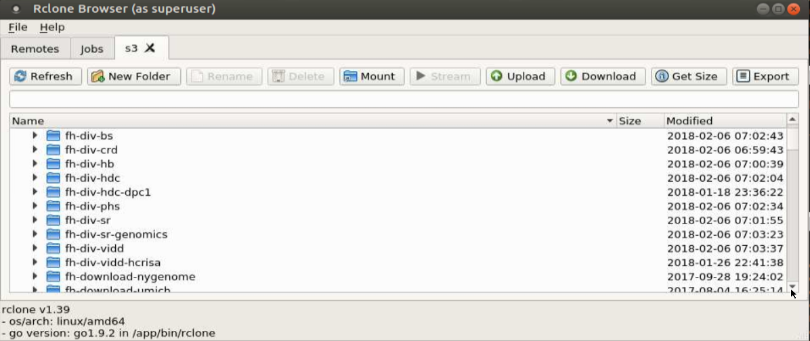
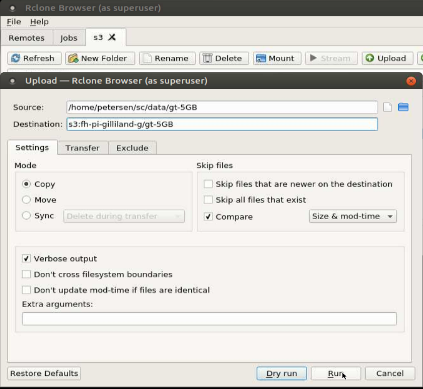
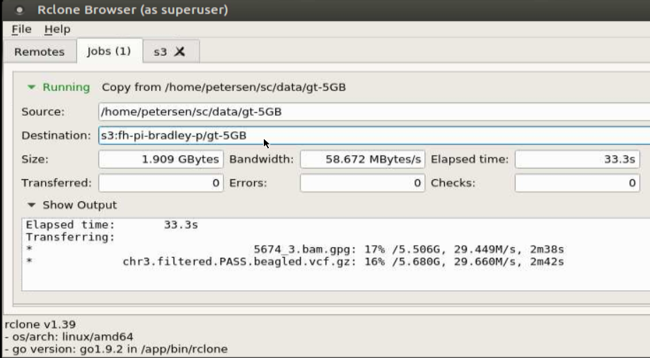

# Copy to cloud with RClone and RClone browser

RClone is a swiss army knife for copying data to cloud storage systems. It
works well with our Economy File Services: Economy Cloud (S3) and Economy
Local (Swift).

Rclone Browser is a user interface to rclone. To use this tool you must have setup your credentials with the `awscreds` command for Economy Cloud or the `sw2account` command for Economy local. IF you have not done this, please search the SciComp wiki at http://scicomp.fhcrc.org for these 2 commands.
After you are done setting up your credentials load the module on a Rhino machine and start rclone-browser:

    petersen@rhino1:~$ ml rclonebrowser
    petersen@rhino1:~$ rclone-browser

 

wait a few seconds for the "remotes" to show up in your list.
To copy data to Economy Cloud service select s3 from the list. This tool will use your credentials stored in .aws/credentials by the `awscreds` tool.

From the list of buckets open a PI bucket (fh-pi-xxx) or a divisional bucket
(fh-dev-xxx) to upload to and click Upload.

For Source select a local folder in Fast File or Scratch and tick the
**verbose output** check box before you hit run.

Then switch to the **Jobs** tab and review the progress of your copy job. You can start more copy jobs as they can all run in parallel.

