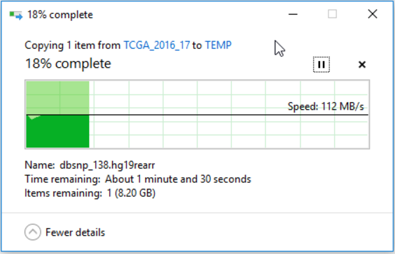
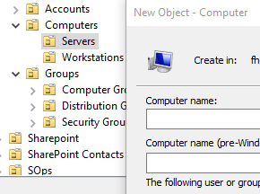

# A Samba Gateway for a Posix FS joined to Active Directory

## Introduction

### What we want
We would like seamless access to our Posix file systems for our Windows and Mac
desktop users. The desktop computers are joined to an AD domain and should not
require to enter a username / password to access the Posix file systems via SMB.

### What we have (Prerequisites)

1. We already have a method of accessing our Posix file systems (via NFS, Gluster,
BeeGFS etc ) from Unix systems
2. We have implemented a method for identity mapping (LDAP, NIS or local files)
with consistent values for uid, uidNumber and gidNumber between Active Directory
and our preferred identify mapping (IDMAP) approach, according to RFC2307
3. the commands `getent group` and `getent passwd` return lists of groups and
gidNumber as well as users and uidNumber in a few seconds without crashing or
timing out.
4. We have configured Kerberos authentication via /etc/krb5.conf and can get
kerberos tickets using the kinit command.
5. Basic stuff: Our server is properly time synced and in the correct time zone
(e.g. ntpd; dpkg-reconfigure tzdata), the command `hostname -f` returns the FQDN,
 `hostname -s` returns the short hostname (aka computername).

If point 2 or 3 are not true for you today please look at implementing a simple
IDMAP service such as ad2openldap: https://pypi.python.org/pypi/ad2openldap .
There are more complex solutions available such as Centrify, SSSD or Winbind but
you will not need them. Also you will not need any PAM configurations if users
are not logging into this Samba server (e.g. via SSH)

## Installation

This installation is currently only tested on **Ubuntu 16.04 & 18.04 **. If you 
have not yet installed the **prerequisites** please review the config files under 
 in this repository.

Login to the system you want to install Samba on, switch to the root user,
install Samba and some other required packages. ldap-utils and libnss-ldap are
only needed if you use ldap as an IDMAP service.

    sudo su -

    export DEBIAN_FRONTEND=noninteractive
    apt update
    apt install -y wget samba krb5-user libsasl2-modules-gssapi-mit msktutil ldap-utils libnss-ldap

and copy a few configurations (you can paste all 3 lines at once):

    mv /etc/samba/smb.conf /etc/samba/smb.conf.orig
    wget https://raw.githubusercontent.com/FredHutch/sc-howto/master/samba/etc/samba/smb.conf -O /etc/samba/smb.conf
    wget https://raw.githubusercontent.com/FredHutch/sc-howto/master/samba/etc/cron.d/krb5_host_ticket_renew -O /etc/cron.d/krb5_host_ticket_renew

## Configuration

Again, please review the **prerequisites** . The configuration will not work if
you have not prepared this (including the basic stuff)

Replace the REALM string MYDOM.ORG and domain MYDOM in smb.conf with your own
settings, e.g. YOURDOMAIN

    sed -i 's/MYDOM.ORG/YOURDOMAIN.COM/' /etc/samba/smb.conf
    sed -i 's/MYDOM/YOURDOMAIN/' /etc/samba/smb.conf

replace the default /scratch folder with something simple that already exists
such as /tmp

    sed -i 's/\/scratch/\/tmp/' /etc/samba/smb.conf

as root use kinit to get a kerberos ticket for the domain account that has
permissions to join computers to the domain and confirm with klist that there is
a kerberos ticket.

    kinit johndoe
      Password for johndoe@YOURREALM.COM:
    klist
      Ticket cache: FILE:/tmp/krb5cc_0
      Default principal: johndoe@YOURREALM.COM

    Valid starting     Expires            Service principal
    12/26/17 12:31:33  12/26/17 22:31:25  krbtgt/YOURREALM.COM@YOURREALM.COM
    	renew until 01/02/18 12:31:25

Join the computer to the domain. 'net ads' is the standard tool that comes with Samba. 
Use the -k option to create the computer account via kerberos authentication and the 
createcomputer option to create it in an AD OU to which you have write access to.

    net ads join createcomputer="SciComp/Computers/Servers" osName="$(lsb_release -cs)" osVer="$(lsb_release -rs)" osServicePack="$(lsb_release -ds)" -k --no-dns-updates
    net ads keytab add -k

restart Samba and check log output to verify that samba is up and running:

    systemctl restart smbd nmbd
    tail /var/log/samba/log.smbd

you should see something like this, otherwise continue with troubleshooting

    [2017/12/26 15:25:29.976673,  0] ../lib/util/become_daemon.c:124(daemon_ready)
    STATUS=daemon 'smbd' finished starting up and ready to serve connections
    [2017/12/26 15:25:29.976865,  2] ../source3/smbd/server.c:1009(smbd_parent_loop)
    waiting for connections

now wait a few minutes and then connect a client to the samba share, continue to
monitor the log output. If you cannot connect continue with troubleshooting.

If all goes well you should be able to (almost) saturate a 1G link using SMB3:

## Troubleshooting

### timing

If you joined the domain successfully but clients cannot connect to the Samba
server you just might have to wait a few minutes until AD replication has caught
up. These error messages can indicate these timing issues:

    connect_to_domain_password_server: unable to open the domain client session to machine RODC1.MYDOM.ORG. Error was : NT_STATUS_NO_TRUST_SAM_ACCOUNT.
    [2017/12/27 17:12:30.094783,  0] ../source3/auth/auth_domain.c:184(domain_client_validate)
     domain_client_validate: Domain password server not available.
    [2017/12/27 17:12:30.094842,  2] ../source3/auth/auth.c:315(auth_check_ntlm_password)
     check_ntlm_password:  Authentication for user [username] -> [username] FAILED with error NT_STATUS_NO_LOGON_SERVERS
    [2017/12/27 17:12:30.094912,  2] ../auth/gensec/spnego.c:716(gensec_spnego_server_negTokenTarg)
     SPNEGO login failed: NT_STATUS_NO_LOGON_SERVERS

### initial steps

In some cases you cannot join the domain, there are several options. As a first
step make sure that you read the **prerequisites** at the beginning of this document.
Then check your local Kerberos keytab using the klist command, it should look
like this:

    root@samba4:~# klist -kte
    Keytab name: FILE:/etc/krb5.keytab
    KVNO Timestamp         Principal
    ---- ----------------- --------------------------------------------------------
    2 12/27/17 13:15:08 samba4$@MYDOM.ORG (arcfour-hmac)
    2 12/27/17 13:15:08 SAMBA4$@MYDOM.ORG (arcfour-hmac)
    2 12/27/17 13:15:08 host/samba4@MYDOM.ORG (arcfour-hmac)
    2 12/27/17 13:15:08 host/samba4.MYDOM.org@MYDOM.ORG (arcfour-hmac)
    2 12/27/17 13:15:08 host/SAMBA4@MYDOM.ORG (arcfour-hmac)

The next troubleshooting step should be changing `log level = 2` to `log level = 4`
in `/etc/samba/smb.conf` and restarting samba (`systemctl restart smbd nmbd`)

### upgrading Samba

if you feel adventurous you can upgrade to the latest samba release

    add-apt-repository ppa:linux-schools/samba-latest
    apt upgrade
    apt install -y samba

### msktutil

msktutil is the most reliable option for joining computers to an AD domain.
Problems can arise if the join is not successful right away. When you try one
of these options please make sure that you always delete the local kerberos keytab
before re-running msktutil (`rm /etc/krb5.keytab`)

* If the domain controller cannot be found use the `--server mydc.mydom.org`
option to set the domain controller
* If the keytab is not created in the right location use `--keytab /etc/krb5.keytab`
* If you are using older versions of windows domain controllers you might have to
fall back to weak DES encryption options. Use `--enctypes 0x07` to set this.
* If users are members of many security groups this can lead to problems. In that
case try `--no-pac`
* Some applications require the computer name to be set. Use `--computer-name
$(hostname -s | tr '/a-z/' '/A-Z/)`
* if you are running msktutil subsequent times remove the --description option as
it does seem to fail in some versions of msktutil
* if none of these options work you should try the latest version from github
https://github.com/msktutil/msktutil.
* if this error message shows up `hostname -f` is likely not returning the fully
qualified domain name. Please fix /etc/hosts

    Error: Another computer account (CN=samba5,OU=Computers,OU=Dept,DC=mydom,DC=org) has the principal host/samba5
    Error: ldap_add_principal failed

### alternative methods

if msktutil does not work in your environment fall back to traditional tools
that can also create keytabs:

#### msktutil 

Please note the option --base. This is the AD organizational unit (OU) the computer account 
will be created in. By default this is cn=Computers but if you have a computer OU in your 
department you would use --base "ou=Computers,ou=Department"

    msktutil --create --service host/$(hostname -s) --service host/$(hostname -f) --set-samba-secret --enctypes 0x4 --dont-expire-password --description "Samba Server by msktutil" --base "cn=Computers"

msktutil should generate this output:

    No computer account for yourhostname found, creating a new one.
    Modified trust account password in secrets database

Mote: msktutil 1.1 does currenty not work with Ubuntu 18.04 (Sept 2019)

#### samba-tool

samba-tool is a newer tool that works sometimes if `net ads` fails

    samba-tool domain join MYDOM -U username
    samba-tool domain exportkeytab /etc/krb5.keytab -U username

Note: The exportkeytab option did not work for me during testing. See other tools.

#### other tools

Other tools might require you to pre-create the computer account in a Windows
tool called **Active Directory Users and Computers**.

After creating the computer account, try joining again.
